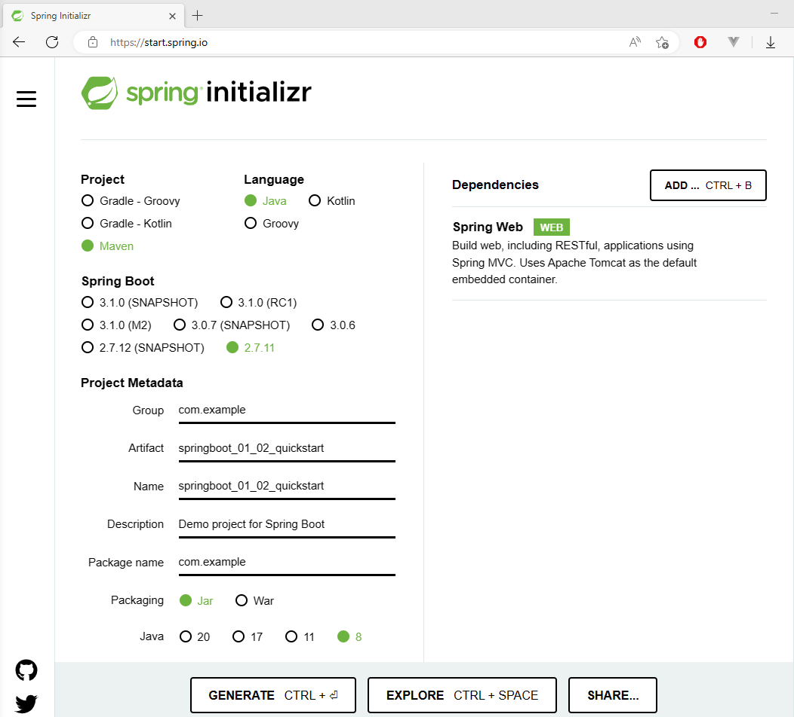

# 入门案例

SpringBoot是为了简化Spring框架的操作。

以下进行快速入门程序。

## 1. IDEA创建SpringBoot项目

创建，

  

勾选依赖，

  

创建好的目录如下，

  

创建一个Controller，

  

运行Application，其中带有一个main方法，

  

控制台显示如下，至此一个基于SpringBoot的Web项目创建完毕。

  

与传统SpringMVC项目对比，

  

> **注意**
>
> IDEA创建SpringBoot项目需要**联网**，以加载程序框架结构。

## 2. Spring官网创建SpringBoot项目

访问Spring官网，进入SpringBoot项目，

  

创建选项与IDEA相同，

  

创建结果以压缩包的形式下载，解压后，导入到IDEA中，其中，导入选项选择Maven，

  

创建目录与IDEA相同，至此创建完毕。

  

## 3. 阿里云创建SpringBoot项目

通过访问阿里云创建SpringBoot项目，Server URL需要修改，

  

它所对应的页面如下，

  

其他步骤与前面所述相同。

## 4. 手工创建SpringBoot项目

正常创建一个Maven项目，

  

添加**继承**和**依赖**，

  

创建Application，

  

至此，手工创建SpringBoot项目完毕。

## 5. 简单分析

  

有以下内容需要分析，

- parent
- starter
- 引导类（Application类）
- 内嵌Tomcat

### 5.1 parent

pom中的parent负责管理依赖以及版本，**避免了版本冲突**，

  

spring-boot-starter-parent的父依赖是spring-boot-dependencies，

  

进入spring-boot-dependencies中发现，在properties下，定义了各种依赖的版本，使得我们在SpringBoot开发中，引入pom坐标时，**不需要指定version**，只需要指定其他两项即可。

  

  

而在阿里云创建的版本中，并没有使用parent，而是导入了spring-boot-dependencies的依赖，效果相同。

  

> 不同版本的SpringBoot，它的依赖的版本也存在差异！

### 5.2 starter

以spring-boot-starter-web为例，它通过依赖传递，导入了web开发所需要的web和webmvc等依赖，

  

不同的starter通过这种方式，引入了相应的开发所需要的依赖，**简化了依赖的导入**。

当然，starter的作用不止如此，后续继续研究！

### 5.3 引导类

parent和starter简化了配置，引导类中的main方法，运行了SpringApplication的run方法，它的返回值是一个ApplicationContext的子类，即Spring容器，可以通过它获取Bean。

  

  

注解SpringBootApplication如下，

  

其中，注解ComponentScan未定义扫描路径，**默认扫描类所在路径及其子包**。

### 5.4 内嵌Tomcat

spring-boot-starter-web依赖了spring-boot-starter-tomcat，它依赖Tomcat内嵌的核心，Spring将内嵌的Tomcat作为对象运行，并交给Spring容器管理，

  

可以通过exclusion去除Tomcat的starter，更换为Jetty的stater，达到更换服务器的效果。

  

SpringBoot支持以下三款服务器，

- Tomcat
- Jetty
- Undertow
