# 基础篇

## 1. 属性配置

SpringBoot的属性配置在resource下的application.properties，如下

  

它可操作的属性有很多，在SpringBoot中导入对应的starter后，提供对应的属性配置。

参考[官方文档](https://springdoc.cn/spring-boot/application-properties.html#application-properties.core.debug)。

## 2. 配置文件

SpringBoot提供了多种属性配置方式，如

- properties，传统格式（默认）
- yml，主流格式
  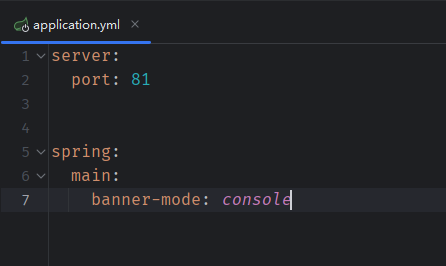  
- yaml
  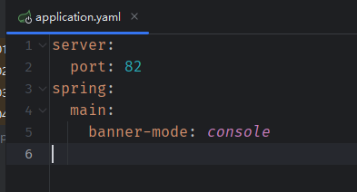  

> 实际上，yml和yaml文件没有任何区别，可以互换使用。

三种文件共存时，properties文件生效；yml和yaml文件共存时，yml生效。即加载优先级：**properties > yml > yaml**。

另外，多个配置文件共存时，相同属性会按照优先级覆盖，不同属性保留。

## 3. YAML

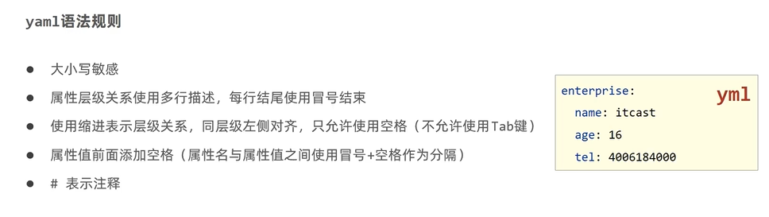  

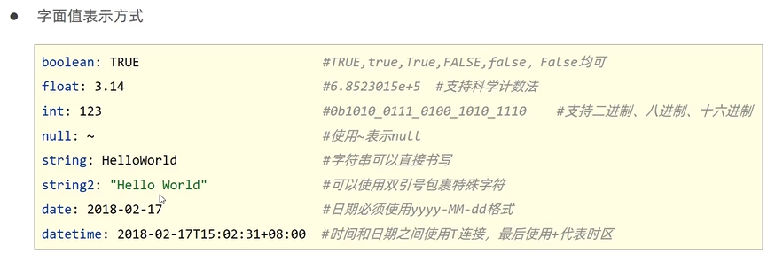  

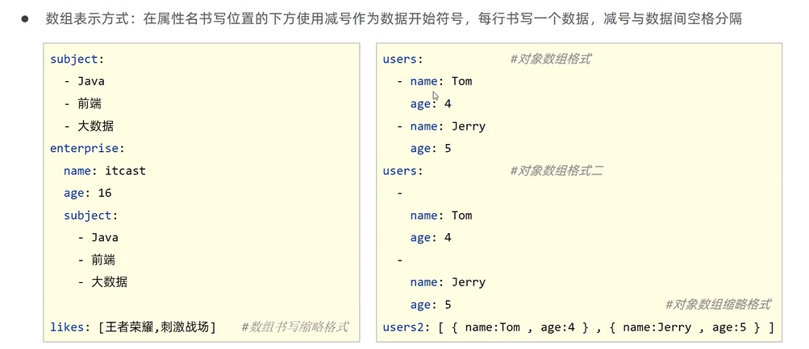  

yaml中引用数据，

```yaml
baseDir: C:\windows

tempDir: ${baseDir}\temp
```

yaml中要使用转义字符，需要使用双引号""包围。

可以使用Enviroment封装全部数据，

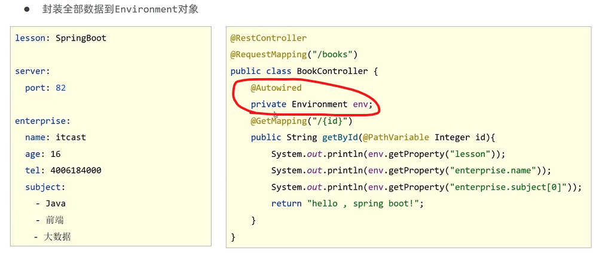  

用对象封装部分数据，并加载到SpringBoot中，

定义POJO对象，添加注解Component和ConfigurationProperties，在ConfigurationProperties中指定需要封装的配置数据对象名，如下

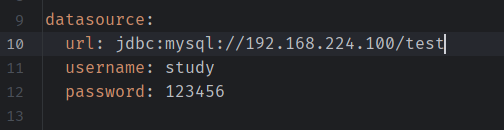  

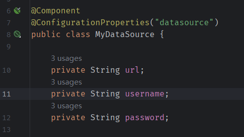  

其他配置信息，也是通过这种方式使得SpringBoot读取的。

## 4. 整合第三方技术

整合第三方技术的一般步骤如下，

- 导入相应的starter
- 添加相应的配置，注意强大的默认配置
- 使用该技术进行开发

### 4.1 整合JUNIT

SpringBoot默认导入了测试依赖，spring-boot-starter-test，

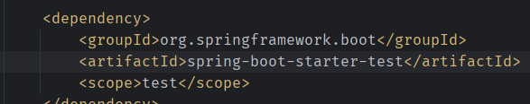  

执行测试，

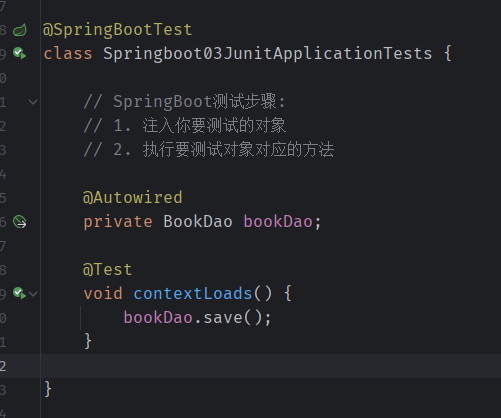  

> 注意，测试类需要有注解SpringBootTest

如果**将测试类移出Application所在包及其子包下**，则无法执行，报错内容如下，

```plain
java.lang.IllegalStateException: Unable to find a @SpringBootConfiguration, you need to use @ContextConfiguration or @SpringBootTest(classes=...) with your test
```

此时，需要在注解SpringBootTest中指定Application，即可正常执行。

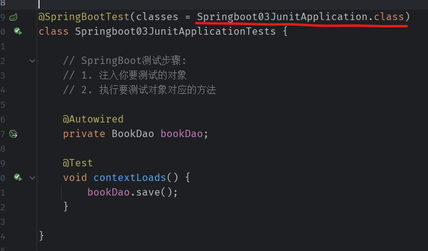  

Application的注解SpringBpptApplication，包含注解SpringBootConfiguration，它包含了Configuration注解，即Application也是Spring容器的配置类。

注解SpringBootTest不指定classes属性时，自动查找**当前包及其子包下**的配置类，如果不存在，则报错，需要通过classes属性指定配置类。

### 4.2 整合MyBatis

MyBatis运行，需要有两部分，

- 核心配置，指定数据库连接信息
- 映射配置，SQL映射

创建SpringBoot项目，添加**MyBatis Framework和MySQL driver**，坐标如下，

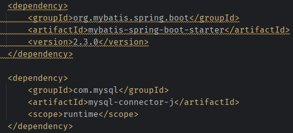  

> SpringBoot的依赖命名规则为，spring-boot-starter-xxx，而第三方适配SpringBoot的依赖，命名规则为 xxx-spring-boot-starter。

添加数据配置信息，

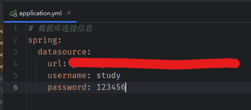  

定义数据实体类，

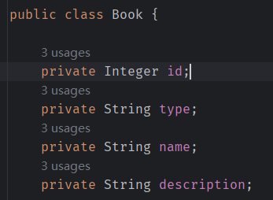  

定义dao，这里也可以使用xml的形式定义映射文件，

  

整合MyBatis完毕。

可以发现，与Spring整合MyBatis相比，不再需要自己定义SqlSessionFactoryBean和DataSource，简化了很多。

在低版本的SpringBoot中，整合MyBatis常见的一些问题，

- `The server time zone value ...`，在数据库连接配置的URL中，添加serverTimeZone参数，或者，修改MySQL数据库配置

### 4.3 整合MyBatis-Plus

由于MyBatis-Plus未被Spring收录，无法直接勾选其starter。

创建项目中，只勾选MySQL driver，完成后，手工导入MyBatis-Plus的starter，

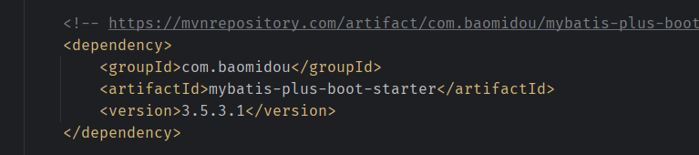  

其他过程与整合MyBatis相同，不同的是，mapper的定义更简单了，

  

只需要**继承BaseMapper**即可实现很多基础的CRUD。

如果存在表名和实体类名称不同，可以通过设置修改，如下，

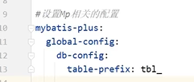

也可以在mapper中使用注解TableName指定表名。

### 4.4 整合Druid

导入坐标,

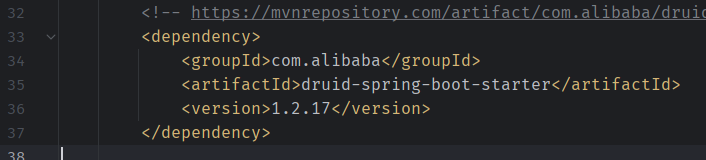  

添加配置有两种方式，

方式一，通用型，

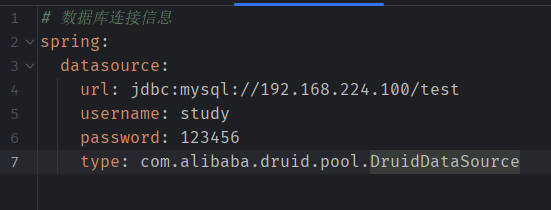  

方式二，Druid专用型，

  

配置完成。

## 5. SSMP整合案例

一个书籍信息的增删改查，

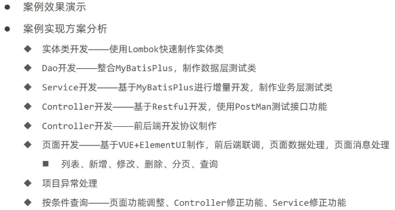  

### 5.1 使用lombok开发实体类

导入坐标，

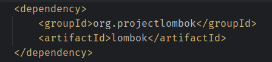  

在实体类上使用注解Data，即可自动生成Getter和Setter，以及hashCode、toString、equals等方法。

### 5.2 数据层开发

技术实现方案，

- MyBatisPlus（MP）
- Druid

MyBatisPlus新增数据时，对于主键有自动生成策略，如果要使用数据库的主键自增策略，需要添加配置如下，

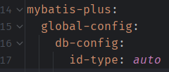  

> MySQL重置主键自增值，`alter table book auto_increment=1;`。

开启MP调试日志，在配置中添加如下设置，可以看出，这里是添加了日志的实现，下面添加的是控制台输出，

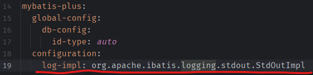  

分页查询功能，MP需要添加分页拦截器实现，

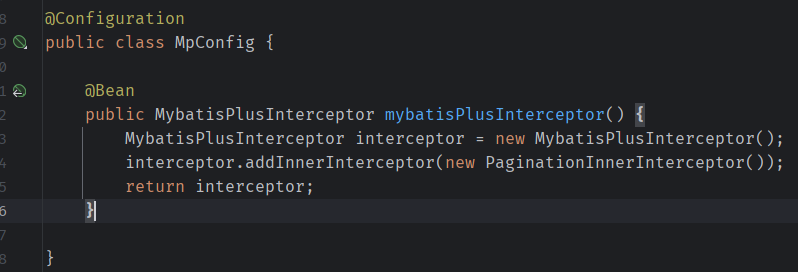  

### 5.3 业务层开发

service层接口定义与dao层的接口的设计区别较大，需要注意，例如，在dao层定义的方法名`getUserByNameAndPassword`，而在service层，对应的是登录功能，需要定义方法为`login`。

可以使用MP简化业务层的开发，

在业务层接口继承IService，

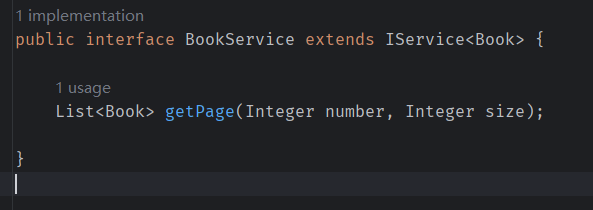  

业务层实现类上，实现业务层接口，并继承ServiceImple，

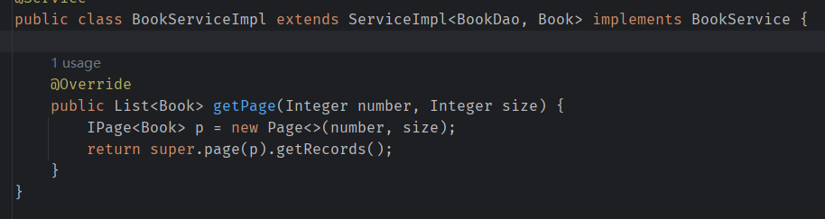  

由此，可以自动提供许多基础的service功能，自定义功能可以通过重载和新增方法。

### 5.4 表现层开发

技术实现，

- 使用Restful风格进行表现层开发
- 使用Postman测试表现层

Controller层开发如下，

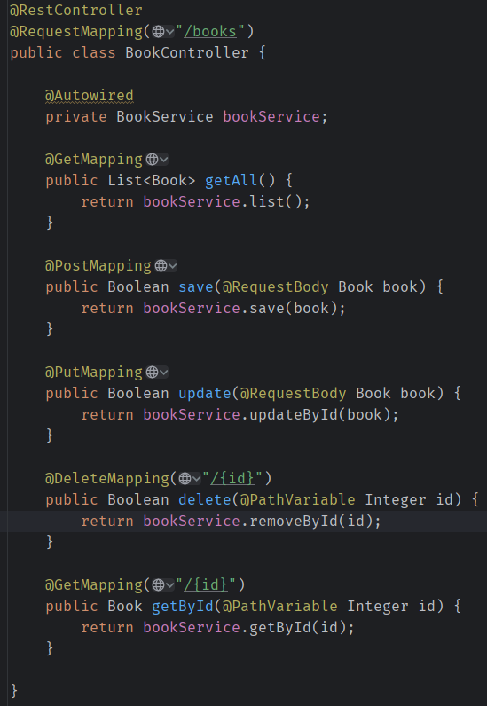  

### 5.5 表现层消息的一致性处理

上一小节的表现层开发中，给到前端的返回值类型不一致，有时候是JSON格式，有时候不是JSON格式，需要做一致性处理，称为**前后端数据协议**。

设计统一的返回对象，

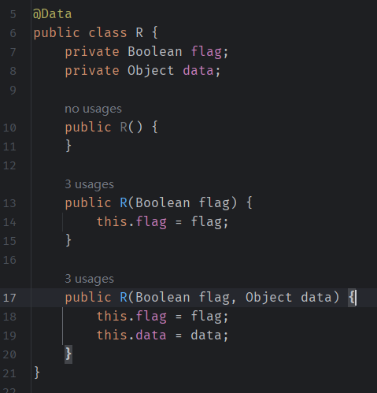  

多个构造方法是为了方便使用。

controller改为，

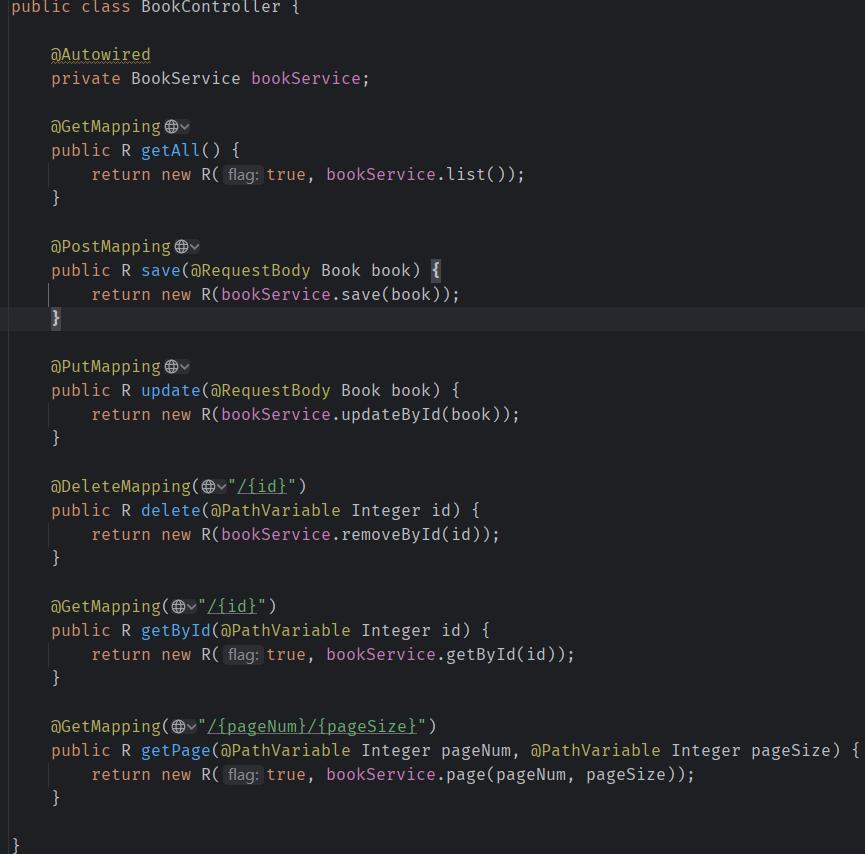  

完成。

### 5.6 对异常的统一处理

添加异常通知，捕获异常，统一返回响应对象R。

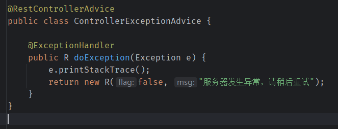  

### 5.7 前端翻译的一些问题

在翻页中，有一些问题需要处理：

- 当前页只有一条数据时，删除数据，当前页为空
- 当前页数据条数与pageSize相同时，新增数据，需要手动翻页才能看到新增数据

参考：[翻页问题参考](https://juejin.cn/post/7159140959458951204)

