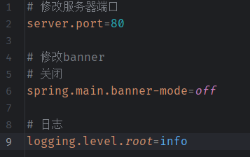
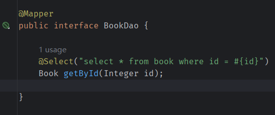
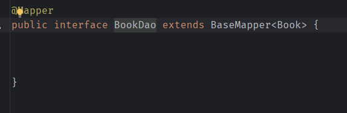

# 基础篇

- [基础篇](#基础篇)
  - [1. 属性配置](#1-属性配置)
  - [2. 配置文件](#2-配置文件)
  - [3. YAML](#3-yaml)
  - [4. 整合第三方技术](#4-整合第三方技术)
    - [4.1 整合JUNIT](#41-整合junit)
    - [4.2 整合MyBatis](#42-整合mybatis)
    - [4.3 整合MyBatis-Plus](#43-整合mybatis-plus)

## 1. 属性配置

SpringBoot的属性配置在resource下的application.properties，如下

  

它可操作的属性有很多，在SpringBoot中导入对应的starter后，提供对应的属性配置。

参考[官方文档](https://springdoc.cn/spring-boot/application-properties.html#application-properties.core.debug)。

## 2. 配置文件

SpringBoot提供了多种属性配置方式，如

- properties，传统格式（默认）
- yml，主流格式
    
- yaml
    

> 实际上，yml和yaml文件没有任何区别，可以互换使用。

三种文件共存时，properties文件生效；yml和yaml文件共存时，yml生效。即加载优先级：**properties > yml > yaml**。

另外，多个配置文件共存时，相同属性会按照优先级覆盖，不同属性保留。

## 3. YAML

  

  

  

yaml中引用数据，

```yaml
baseDir: C:\windows

tempDir: ${baseDir}\temp
```

yaml中要使用转义字符，需要使用双引号""包围。

可以使用Enviroment封装全部数据，

  

用对象封装部分数据，并加载到SpringBoot中，

定义POJO对象，添加注解Component和ConfigurationProperties，在ConfigurationProperties中指定需要封装的配置数据对象名，如下

  

  

其他配置信息，也是通过这种方式使得SpringBoot读取的。

## 4. 整合第三方技术

整合第三方技术的一般步骤如下，

- 导入相应的starter
- 添加相应的配置
- 使用该技术进行开发

### 4.1 整合JUNIT

SpringBoot默认导入了测试依赖，spring-boot-starter-test，

  

执行测试，

  

> 注意，测试类需要有注解SpringBootTest

如果**将测试类移出Application所在包及其子包下**，则无法执行，报错内容如下，

```context
java.lang.IllegalStateException: Unable to find a @SpringBootConfiguration, you need to use @ContextConfiguration or @SpringBootTest(classes=...) with your test
```

此时，需要在注解SpringBootTest中指定Application，即可正常执行。

  

Application的注解SpringBpptApplication，包含注解SpringBootConfiguration，它包含了Configuration注解，即Application也是Spring容器的配置类。

注解SpringBootTest不指定classes属性时，自动查找**当前包及其子包下**的配置类，如果不存在，则报错，需要通过classes属性指定配置类。

### 4.2 整合MyBatis

MyBatis运行，需要有两部分，

- 核心配置，指定数据库连接信息
- 映射配置，SQL映射

创建SpringBoot项目，添加**MyBatis Framework和MySQL driver**，坐标如下，

  

> SpringBoot的依赖命名规则为，spring-boot-starter-xxx，而第三方适配SpringBoot的依赖，命名规则为 xxx-spring-boot-starter。

添加数据配置信息，

  

定义数据实体类，

  

定义dao，这里也可以使用xml的形式定义映射文件，

  

整合MyBatis完毕。

可以发现，与Spring整合MyBatis相比，不再需要自己定义SqlSessionFactoryBean和DataSource，简化了很多。

在低版本的SpringBoot中，整合MyBatis常见的一些问题，

- `The server time zone value ...`，在数据库连接配置的URL中，添加serverTimeZone参数，或者，修改MySQL数据库配置

### 4.3 整合MyBatis-Plus

由于MyBatis-Plus未被Spring收录，无法直接勾选其starter。

创建项目中，只勾选MySQL driver，完成后，手工导入MyBatis-Plus的starter，

  

其他过程与整合MyBatis相同，不同的是，mapper的定义更简单了，

  

只需要**继承BaseMapper**即可实现很多基础的CRUD。

如果存在表名和实体类名称不同，可以通过设置修改，如下，


也可以在mapper中使用注解TableName指定表名。
