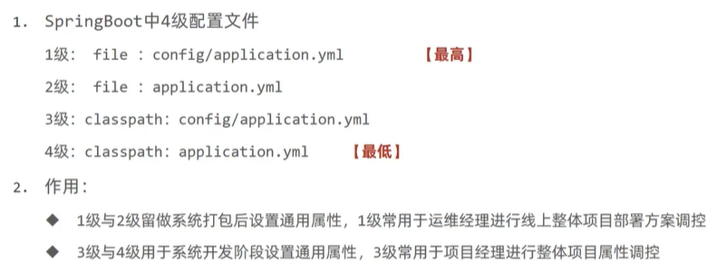

# 运维实用篇

## 1. 打包与运行

要使得SpringBoot项目打包成可执行jar，需要添加maven插件，

  

由此打出的jar，定义了主类和启动类，可以直接启动。

Linux下，后台运行命令，

```shell
nohup java -jar springboot_08_ssmp-0.0.1-SNAPSHOT.jar > server.log 2>&1 &
```
> ubuntu下配置oracle jdk8步骤
>
> 1. Oracle官网下载jdk8的tar包（命令行模式jdk8已无法安装）
> 2. 解压tar包至/usr/lib/jvm路径，`tar -zxvf ~/jdk-8u202-linux-x64.tar.gz -C /usr/lib/jvm`
> 3. 添加环境变量，`vim ~/.bashrc`，  
> 4. 刷新环境变量，`source ~/.bashrc`
> 5. 添加java，`sudo update-alternatives --install /usr/bin/java java /usr/lib/java/jdk1.8.0_202/bin/java 300`，其中，300是优先级
> 6. 多java环境改变版本，`sudo update-alternatives --config java`

## 2. 配置高级

启动时，修改端口，

```shell
nohup java -jar springboot_08_ssmp-0.0.1-SNAPSHOT.jar --server.port=8080> server.log 2>&1 &
```

参考，[各项配置优先级](https://docs.spring.io/spring-boot/docs/2.1.9.RELEASE/reference/html/boot-features-external-config.html)

  

优先级由低到高。

## 3. 四级配置文件

在resources下，创建文件夹config，可以存放配置文件，优先级高于resources根目录下的配置文件，可以作为统一的配置管理。

  

在正式上线时，诸如数据库密码等是不可知的，那应如何作配置？

SpringBoot项目的jar包会自动读取与它同目录的配置文件，可以做诸如数据库密码等的配置管理。

  

更高一级的配置管理，可以存放在jar包同路径下的config文件夹下，由此形成了四级配置文件管理。

  

## 4. 自定义配置文件

SpringBoot可以自定义配置文件名，

在启动参数中传入spring.config.name，指定配置文件名，

  

通过启动参数spring.config.location，指定配置文件路径，

  

多个配置可以以逗号分隔。

多服务器项目使用自定义配置文件需求较高，将所有配置放置在一个目录中，统一管理。基于SpringCloud技术，所有的服务器将不再设置配置文件，而是通过配置中心进行设定，动态加载配置信息。

## 5. 多环境开发

生产环境、测试环境和开发环境配置不同，如何在多环境下进行配置管理呢？

