# 开发实用篇

## 1. 热部署

关于热部署，有两个名词要理解，

- 重启，restart，自定义开发的代码，加载位置restart类加载器
- 重载，reload，jar包发生改变，加载位置base类加载器

前者在开发时，经常发生改变，而后者的变化频率不高，热部署就是解决重启的问题。

SpringBoot提供了热部署工具，

引入依赖，

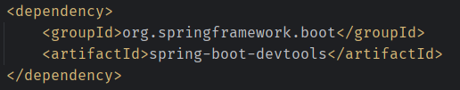  

在代码修改完成后，点击IDEA中的`Build Project`即可。

## 2. 高级配置

### 2.1 注解ConfigurationProperties

注解EnableConfigurationProperties和注解ConfigurationProperties的使用，它们可以为第三方Bean绑定属性，

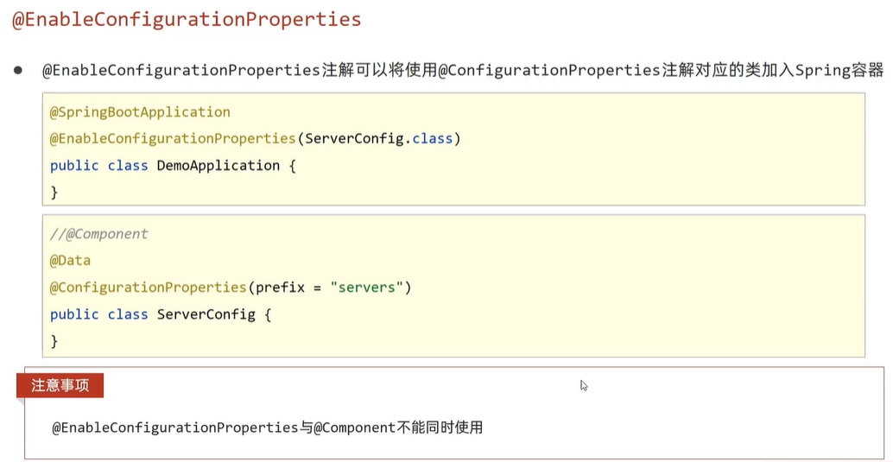  

### 2.2 宽松绑定

当使用注解ConfigurationProperties绑定属性时，支持属性名的**宽松绑定**，如下，

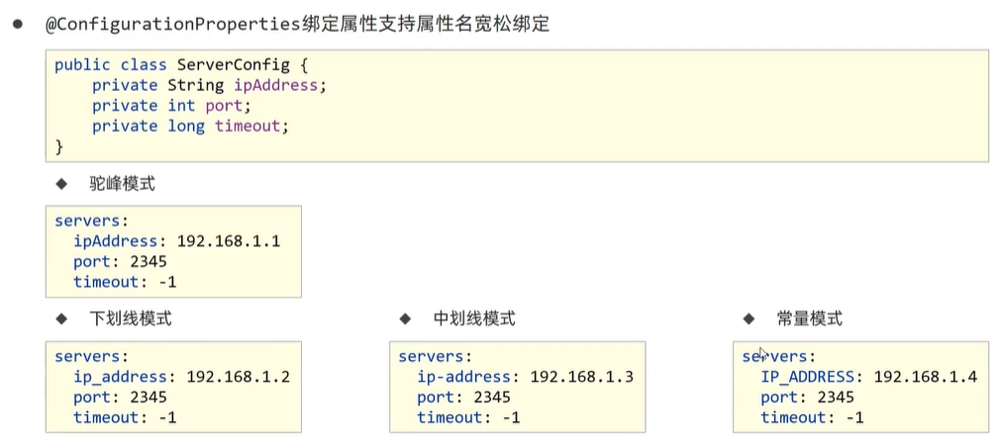  

> **注意**
> 宽松绑定不支持注解Value引用单个属性的方式

另外，需要注意的是，注解ConfigurationProperties绑定的**前缀命名，仅能使用纯小写字母、数字、下划线作为合法的字符**。

### 2.3 配置的单位

在配置时间和存储空间时，单位容易产生误解，SpringBoot支持jdk8新的单位定义，如下，

```java
@DurationUnit(ChronoUnit.SECONDS)
private Duration serverTimeout;
@DataSizeUnit(DataUnit.MEGABYTES)
private DataSize dataSize;
```

可以通过注解规定配置数值的单位，也可以在配置文件中直接声明单位。

### 2.4 数据校验

配置时，可以使用数据格式校验，

添加依赖，

```xml
<!-- 校验接口 -->
<dependency>
    <groupId>jakarta.validation</groupId>
    <artifactId>jakarta.validation-api<artifactId>
</dependency>

<!-- 校验实现 -->
<dependency>
    <groupId>org.hibernate.validator</groupId>
    <artifactId>hibernate-validator</artifactId>
</dependency>
```

使用方式如下，在类上添加注解Validated，属性上添加校验规则，

```java
@Data
@Component
@ConfigurationProperties(prefix = "servers")
@Validated
public class ServerConfig {
    ...
    @Max(value = 8888, message = "最大值不能超过8888")
    @Min(value = 202, message = "最小值不能小于202")
    private int port;
    ...
}
```

支持的校验规则，可以查看jakarta.validation-api的jar包，hibernate-validator也额外提供了其他校验规则。

> 配置中的字符串，最好使用双引号包裹。

## 3. 测试

测试中注入参数，

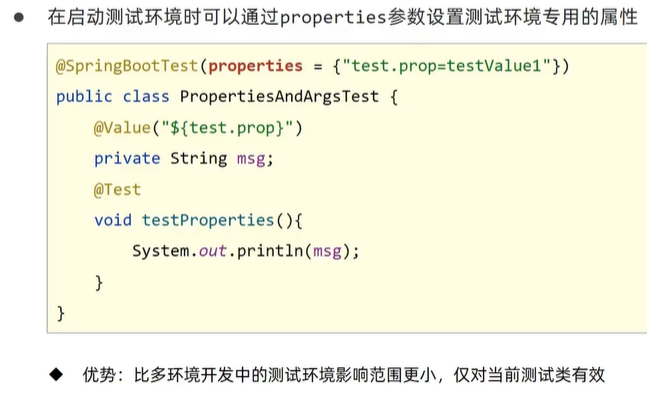  

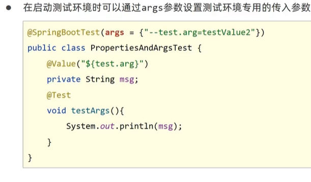  

加载测试用的Bean，

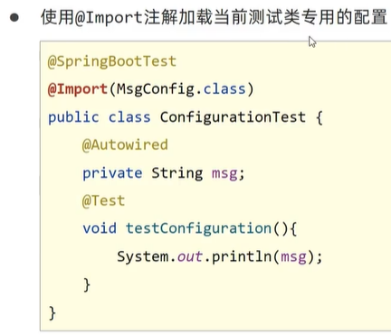  

测试时，使用Web环境，需要使用注解SpringBootTest的属性WebEviroment，

  

进入测试时，操作步骤如下，

1. 开启虚拟调用，在测试类上使用注解AutoConfigureMvc
2. 创建虚拟请求，使用工具类MockMvcRequestBuilders创建
3. 执行对应的请求

如下，

```java
@SpringBootTest(webEnvironment = SpringBootTest.WebEnvironment.RANDOM_PORT)
// 1. 开启虚拟调用
@AutoConfigureMockMvc
public class WebTest {
    @Test
    void testWeb(@Autowired MockMvc mvc) throws Exception {
        // 2. 创建虚拟请求
        RequestBuilder builder = MockMvcRequestBuilders.get("/books");
        // 3. 执行对应的请求
        mvc.perform(builder);
    }
}
```

> **注意**
> 测试方法中注入参数，不能在方法上使用注解Autowired，否则会报错，提示要将Autowired声明在参数列表中。

接下来，使用断言分析请求结果，

断言响应状态，

```java
RequestBuilder builder = MockMvcRequestBuilders.get("/books1");
ResultActions actions = mvc.perform(builder);

// 设定预期值
StatusResultMatchers status = MockMvcResultMatchers.status();
// 预计本次调用成功的，状态200
ResultMatcher ok = status.isOk();
// 添加预计值与本次调用结果的匹配
actions.andExpect(ok);
```

断言响应内容，

```java
@Test
void testBody(@Autowired MockMvc mvc) throws Exception {
    RequestBuilder builder = MockMvcRequestBuilders.get("/books");
    ResultActions actions = mvc.perform(builder);

    ContentResultMatchers content = MockMvcResultMatchers.content();
    ResultMatcher result = content.string("BookController is running...");
    actions.andExpect(result);
}
```

断言JSON格式响应内容，

```java
@Test
void testJson(@Autowired MockMvc mvc) throws Exception {
    RequestBuilder builder = MockMvcRequestBuilders.get("/books");
    ResultActions actions = mvc.perform(builder);

    ContentResultMatchers content = MockMvcResultMatchers.content();
    ResultMatcher json = content.json("{\"id\":2,\"name\":\"springboot\",\"type\":\"tech\"}");
    actions.andExpect(json);
}
```

断言响应头，以Content-Type为例，

```java
@Test
void testHead(@Autowired MockMvc mvc) throws Exception {
    RequestBuilder builder = MockMvcRequestBuilders.get("/books");
    ResultActions actions = mvc.perform(builder);

    HeaderResultMatchers header = MockMvcResultMatchers.header();
    ResultMatcher string = header.string("Content-Type", "application/json");
    actions.andExpect(string);
}
```

测试数据的回滚，**在测试类上使用注解Transactional**，默认回滚。

测试用例设置随机值，

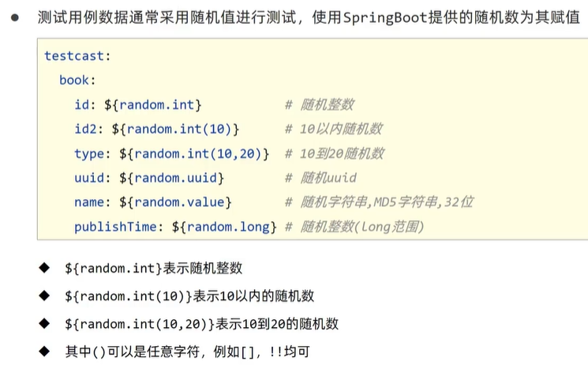  

## 4. 数据层解决方案

主要分为两部分，

- SQL
- NoSQL

### 4.1. 内置数据源

除了Druid数据源，SpringBoot内置了三个数据源可供使用，

- Hikari（默认）
- Tomcat提供的DataSource
- Commons DBCP

### 4.2 持久化技术

除了MyBatis以外，Spring提供了内置的持久化解决方案——JdbcTemplate。

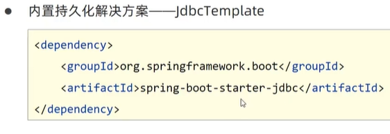  

### 4.3 内嵌数据库

SpringBoot提供了三种内嵌数据库，

- H2
- HSQL
- Derby

以H2为例，

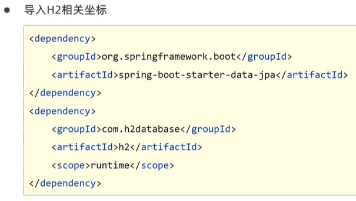  

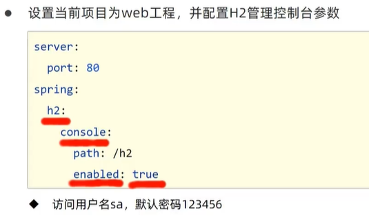  

### 4.4 redis

redis是一款key-value存储结构的**内存级**NoSQL数据库，它有以下特点，

- 支持多种数据存储格式
- 支持持久化
- 支持集群

导入的坐标，

```xml
<dependency>
    <groupId>org.springframework.boot</groupId>
    <artifactId>spring-boot-starter-data-redis</artifactId>
</dependency>
```

配置文件中添加redis配置，默认端口6379。

通过RedisTemplate操作redis数据，根据其提供的不同方法操作不同的数据类型。

在测试程序中，向redis添加数据后，通过终端发现，数据并不同步，这是由RedisTemplate造成的。

RedisTemplate需要一个泛型，未指定时，默认按**对象**存储，redis内部将数据序列化后存储，如下，

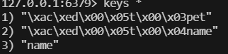  

可以使用**StringRedisTemplate**解决，它将所有数据按照字符串存储。

SpringBoot客户端默认使用lettuce实现，如果要使用jedis需要导入jedis依赖，以及在配置中指定client-type为jedis。

### 4.5 MongoDB

MongoDB是一个无模式的文档型数据库，它可以解决永久性存储与临时性存储相结合，修改频度高的情景。
